# Ansible playbook: labocbz.deploy_mariadb


## Description


An Ansible playbook to deploy and configure Mariadb on your host.

This playbook streamlines the installation and configuration of MariaDB. It offers the flexibility to configure a multi-master cluster using Galera. The playbook is adept at setting up and configuring the cluster while also allowing you to modify and customize an administrative account for enhanced security. Additionally, it automates the steps typically carried out by the mysql_secure_installation command, making your MariaDB deployment and management even more convenient and secure.

With this playbook, you can effortlessly manage MariaDB, whether it's a standalone installation or a complex, multi-master cluster, while ensuring security and reliability.

## Deployment diagramm



This represents a potential deployment achieved with this playbook. We can observe a MariaDB service component, with the subsystem consisting of three MariaDB components installed across three servers. We can see that the nodes interact with each other, creating a multi-master cluster, which comes with its own set of advantages and disadvantages. Communications are end-to-end encrypted, and we can even implement mTLS for enhanced security.

## Tests and simulations

### Basics

You have to run multiples tests. *tests with an # are mandatory*

```MARKDOWN
# lint
# syntax
# converge
# idempotence
# verify
side_effect
```

Executing theses test in this order is called a "scenario" and Molecule can handle them.

Molecule use Ansible and pre configured playbook to create containers, prepare them, converge (run the playbook) and verify its execution.
You can manage multiples scenario with multiples tests in order to get a 100% code coverage.

This playbook contains a ./tests folder. In this folder you can use the inventory or the tower folder to create a simualtion of a real inventory and a real AWX / Tower job execution.

### Command reminder

```SHELL
# Check your YAML syntax
yamllint -c ./.yamllint .

# Check your Ansible syntax and code security
ansible-lint --config=./.ansible-lint .

# Execute and test your playbook
molecule lint
molecule create
molecule list
molecule converge
molecule verify
molecule destroy

# Execute all previous task in one single command
molecule test
```

## Installation

To install this playbook, just copy/import this playbook or raw file into your fresh playbook repository or call it with the "include_playbook/import_playbook" module.

## Usage

### Vars

```YAML
# From inventory
---
# all vars from to put/from your inventory
# see tests/inventory/group_var for all groups and vars.
```

```YAML
# From AWX / Tower
---
all vars from to put/from AWX / Tower
```

## Architectural Decisions Records

Here you can put your change to keep a trace of your work and decisions.

### 2023-10-16: First Init

* First init of this playbook with the bootstrap_playbook playbook by Lord Robin Crombez

### 2023-10-19: Fix and Push

* Playbook can deploy Mariadb in cluster or standalone
* Readme and schema added

## Authors

* Lord Robin Crombez

## Sources

* [Ansible playbook documentation](https://docs.ansible.com/ansible/latest/playbook_guide/playbooks_reuse_playbooks.html)
* [Ansible Molecule documentation](https://molecule.readthedocs.io/)
* [labocbz.install_mariadb](https://github.com/CBZ-D-velop/Ansible-Role-Labocbz-Install-Mariadb.git)
